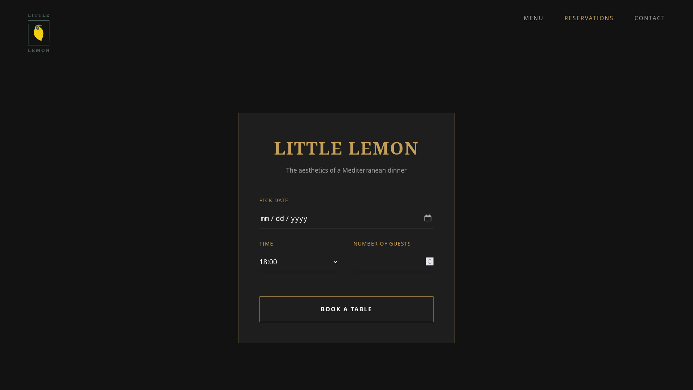

### Little Lemon – Table Reservation System

A streamlined web application for managing restaurant reservations. This project focuses on a seamless user journey, moving from initial booking details to final customer confirmation within a unified, modern interface.
Key Features

    Sequential Booking Flow: A multi-step reservation process that separates table details (date, time, guests) from customer contact information to reduce cognitive load.

    Controlled Form State: Real-time synchronization of user input with the application state, allowing for immediate feedback and dynamic UI updates.

    Midnight Gold Aesthetic: A custom-designed, dark-themed minimalist interface focused on readability and a premium "Fine Dining" feel.

    Instant Confirmation: A dynamic transition system that displays a success summary upon completion without requiring a page reload.

### Getting Started

To run this project locally, ensure you have Node.js installed on your system.
Installation

## Clone the repository and install dependencies

    npm install

### Execution

## Start the development server

    npm start

The application will be available at http://localhost:3000.

### Production Build

## Create an optimized production build
    npm run build

### Future Roadmap

    API Integration: Connect the frontend to a backend service for real-time seat availability checks.

    Enhanced Validation: Implement complex client-side validation for phone numbers and email formats using custom hooks.

    User Accounts: Add the ability for returning customers to view and manage their previous reservations.

*i use arch btw*,\
just so you know
